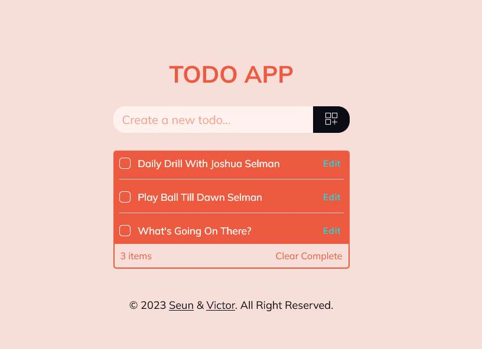

# ToDo JavaScript App

This is a simple ToDo App created using JavaScript. It allows users to add, edit, and delete tasks on a list.

## Installation

1. Clone this repository to your local machine using:
git clone https://github.com/YourmixJNR/Todo/tree/todo-design

2. Open the project directory in your terminal.

3. Run the following command to install the required dependencies:

4. Once the installation is complete, you can start the app by running:

5. Open your browser and go to `http://localhost:3000` to view the app.

## Usage

To add a task, enter the task name in the input field and click the `Add Task` button. To edit a task, click the `Edit` button next to the task and modify the task name in the input field. To delete a task, click the `Delete` button next to the task.
<!-- you will have to edit this to make it true -->
## Contributing

If you'd like to contribute to this project, feel free to submit a pull request. Please make sure to follow the [Contributing Guidelines](Contributing.md).

## License

This project is licensed under the [MIT License](LICENSE).

